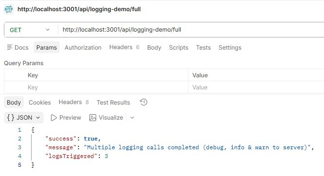

# 22MIA1077 - GitHub Submission

## Structure

- `logging_middleware/` reusable logging package

- `vehicle_scheduling/` vehicle maintenance scheduling microservice
- `notification_app_be/` notification backend service and priority inbox implementation
- `notification_system_design.md` staged design response

Along with respective postman screenshots for the scheduling & notification services.