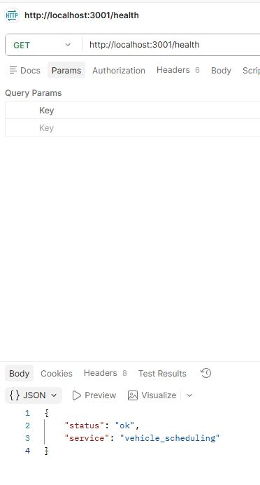
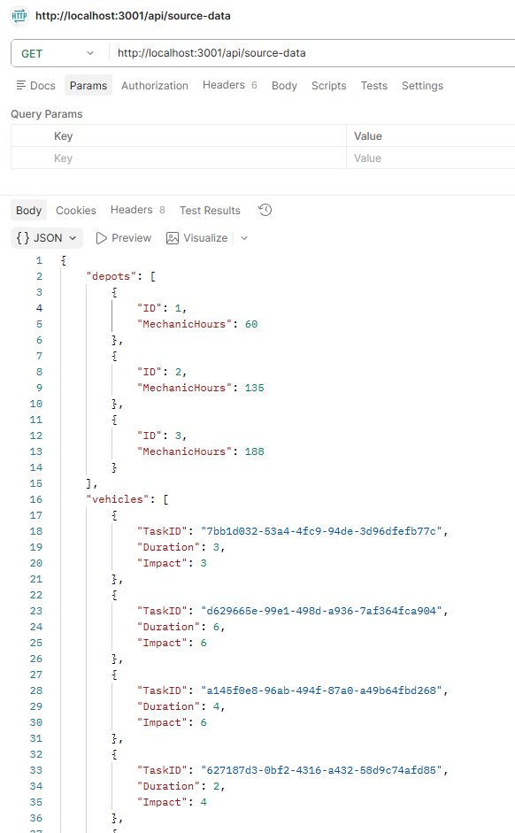
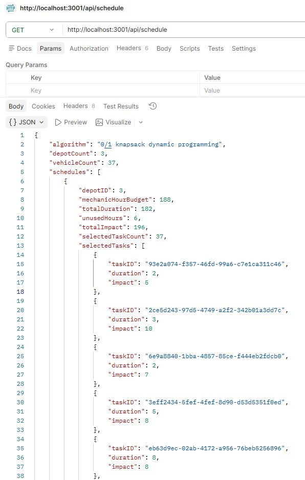
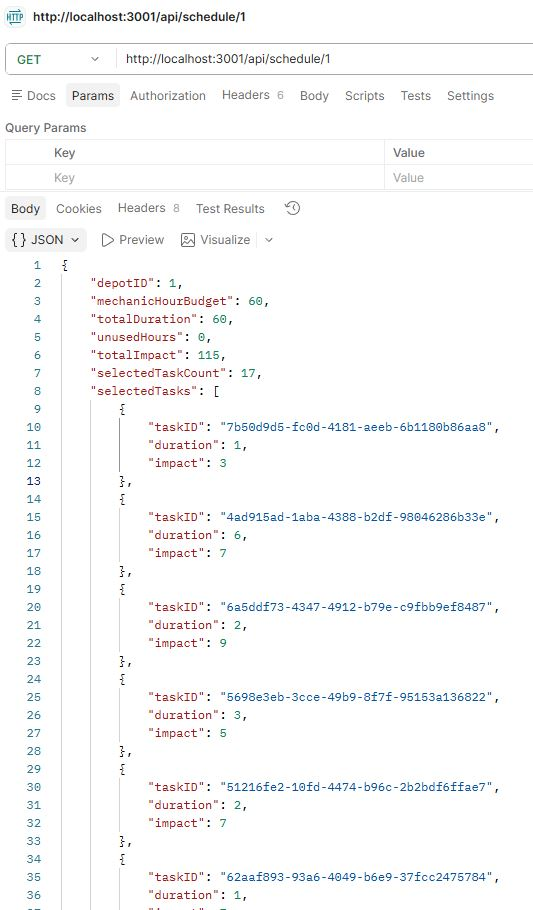
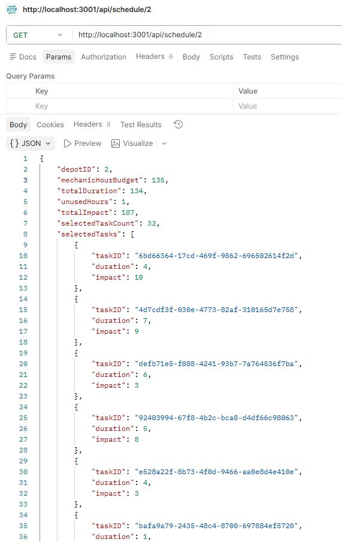

# Vehicle Scheduling Service Backend

## Endpoints

- `GET /health`
- `GET /api/source-data`
- `GET /api/schedule`
- `GET /api/schedule/:depotId`

## Algorithm

The service uses 0/1 knapsack dynamic programming.

- Weight = service duration
- Value = operational impact
- Capacity = mechanic hours available at the depot

Time complexity: `O(n * H)`, where `n` is number of tasks and `H` is mechanic-hour budget.
Space complexity: `O(H)` for DP values, plus selected task reconstruction data.

## Screenshots

